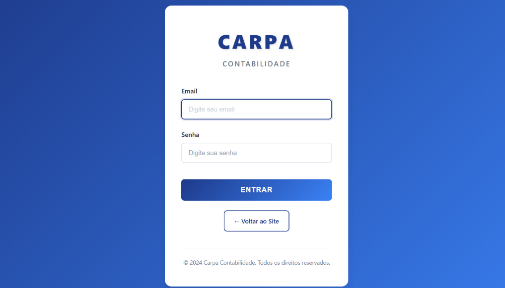

# CARPA CONTABILIDADE - SISTEMA WEB DE GESTÃO CONTÁBIL

---

## LABORATÓRIO DE PROGRAMAÇÃO II

**Disciplina:** Laboratório de Programação II
**Professor:** Cap Vanzan
**Instituição:** Instituto Militar de Engenharia (IME)
**Período:** 2025/1
**Data de Entrega:** 19/11/2024

---

### INTEGRANTES DO PROJETO

- **Rafael Carvalheira**
  Instituição: Instituto Militar de Engenharia (IME)
  Curso: Engenharia da Computação

- **Marcell Parra**
  Instituição: Instituto Militar de Engenharia (IME)
  Curso: Engenharia da Computação

---

<div style="page-break-after: always;"></div>

# 1. SOBRE O SISTEMA

## 1.1. Nome e Descrição do Projeto

**Nome:** CARPA Contabilidade - Sistema Web de Gestão Contábil

**Descrição:**
Sistema web completo para gerenciamento de serviços contábeis, desenvolvido com Spring Boot e PostgreSQL. O sistema permite que escritórios de contabilidade gerenciem seus clientes e que os clientes acessem seus documentos e relatórios financeiros de forma online.

## 1.2. Objetivos do Sistema

### Objetivo Geral
Desenvolver uma plataforma web integrada que facilite a comunicação entre escritórios de contabilidade e seus clientes, automatizando o processo de envio de documentos, processamento de dados contábeis e geração de relatórios financeiros.

### Objetivos Específicos
1. **Autenticação e Autorização Segura**
   - Implementar sistema de login com criptografia BCrypt
   - Diferenciar acessos entre Administradores e Clientes
   - Garantir segurança das informações através do Spring Security

2. **Gestão de Documentos Contábeis**
   - Permitir upload de arquivos CSV e Excel contendo dados financeiros
   - Armazenar metadados dos documentos no banco de dados
   - Processar automaticamente os arquivos enviados

3. **Processamento e Análise de Dados**
   - Ler e validar dados de arquivos CSV/Excel
   - Calcular métricas financeiras automaticamente (receitas, despesas, saldo, margem)
   - Gerar relatórios mensais com análises detalhadas

4. **Visualização de Relatórios**
   - Apresentar dados através de dashboards interativos
   - Exibir gráficos (pizza, barras) para melhor compreensão
   - Permitir filtragem de relatórios por período

5. **Interface Responsiva e Intuitiva**
   - Desenvolver interface moderna e fácil de usar
   - Garantir boa experiência do usuário (UX)
   - Implementar feedback visual para ações do usuário

## 1.3. Funcionalidades Planejadas e Implementadas

### ✅ Funcionalidades Implementadas

#### Módulo de Autenticação
- [x] Página de login personalizada
- [x] Autenticação via Spring Security
- [x] Criptografia de senhas com BCrypt
- [x] Redirecionamento automático baseado no tipo de usuário
- [x] Logout seguro com invalidação de sessão

#### Módulo Administrativo
- [x] Dashboard administrativo com estatísticas
- [x] Gerenciamento completo de usuários (CRUD)
- [x] API REST para gerenciamento de usuários
- [x] Interface de cadastro e edição de usuários

#### Módulo do Cliente
- [x] Dashboard personalizado para clientes
- [x] **Upload de documentos CSV/Excel**
- [x] **Processamento automático de arquivos**
- [x] **Geração de relatórios mensais**
- [x] **Visualização de relatórios com gráficos**
- [x] **Filtragem de relatórios por mês e ano**
- [x] Lista de documentos enviados
- [x] Exclusão de documentos

#### Processamento de Dados
- [x] **Leitura de arquivos CSV**
- [x] **Leitura de arquivos Excel (XLSX)**
- [x] **Validação de formato e dados**
- [x] **Cálculo automático de métricas financeiras**
- [x] **Análise por categoria, centro de custo e forma de pagamento**

#### Relatórios e Análises
- [x] **Dashboard com KPIs (Receita, Despesa, Saldo, Margem)**
- [x] **Gráficos de pizza para despesas e receitas por categoria**
- [x] **Gráfico de barras para comparação receitas vs despesas**
- [x] **Top 10 maiores receitas e despesas**
- [x] **Análise detalhada por centro de custo**
- [x] **Análise por forma de pagamento**

### 🔄 Funcionalidades Futuras
- [ ] Exportação de relatórios em PDF
- [ ] Notificações por email
- [ ] Comparação entre períodos diferentes
- [ ] Gráfico de evolução mensal
- [ ] Upload em lote de documentos
- [ ] Sistema de chat/suporte integrado

## 1.4. Mockup e Planejamento de Telas

### Fluxo de Navegação

```
┌─────────────┐
│    Login    │
└──────┬──────┘
       │
       ├─────────────────┬─────────────────┐
       │                 │                 │
       v                 v                 v
┌──────────────┐  ┌──────────────┐  ┌──────────────┐
│   Dashboard  │  │   Dashboard  │  │   Gerenciar  │
│     Admin    │  │    Cliente   │  │   Usuários   │
└──────────────┘  └──────┬───────┘  └──────────────┘
                         │
                  ┌──────┴──────┐
                  │             │
                  v             v
           ┌──────────┐  ┌──────────────┐
           │  Upload  │  │  Relatórios  │
           │Documento │  │   Mensais    │
           └──────────┘  └──────────────┘
```

### Telas Principais

1. **Tela de Login**
   - Campo: Email
   - Campo: Senha
   - Botão: Entrar
   - Mensagens de erro em vermelho

2. **Dashboard Admin**
   - Cards com estatísticas
   - Menu lateral navegável
   - Acesso rápido às funcionalidades
   - Link para gerenciamento de usuários

3. **Dashboard Cliente**
   - Cards de serviços disponíveis
   - Menu lateral com navegação
   - Acesso rápido a Upload e Relatórios
   - Área de avisos importantes

4. **Upload de Documentos**
   - Área de drag-and-drop para arquivos
   - Seleção de mês e ano de referência
   - Preview do arquivo selecionado
   - Lista de documentos enviados com status
   - Botões de ação (Excluir)

5. **Relatórios Mensais**
   - Filtros por mês e ano
   - Lista de relatórios disponíveis
   - Dashboard interativo com:
     - 4 KPIs principais (cards)
     - 3 gráficos (2 pizza, 1 barras)
     - 2 tabelas (Top 10 receitas e despesas)

---

<div style="page-break-after: always;"></div>

# 2. SOBRE A IMPLEMENTAÇÃO

## 2.1. Arquitetura do Projeto

### 2.1.1. Padrão Arquitetural

O sistema utiliza a arquitetura **MVC (Model-View-Controller)** com **camada de serviços**, seguindo as melhores práticas do Spring Boot:

```
┌─────────────────────────────────────────────────┐
│                   CLIENTE                       │
│            (Navegador Web - HTTP)               │
└────────────────────┬────────────────────────────┘
                     │
                     v
┌─────────────────────────────────────────────────┐
│              SPRING SECURITY                    │
│          (Autenticação e Autorização)           │
└────────────────────┬────────────────────────────┘
                     │
                     v
┌─────────────────────────────────────────────────┐
│               CONTROLLERS                       │
│  - HomeController                               │
│  - LoginController                              │
│  - AdminController                              │
│  - ClienteController                            │
│  - DocumentoController (REST)                   │
│  - RelatorioController (REST)                   │
│  - UsuarioRestController (REST)                 │
└────────────────────┬────────────────────────────┘
                     │
                     v
┌─────────────────────────────────────────────────┐
│                SERVICES                         │
│  - UsuarioService                               │
│  - DocumentoService                             │
│  - RelatorioService                             │
│  - FileStorageService                           │
│  - CsvProcessadorService                        │
└────────────────────┬────────────────────────────┘
                     │
                     v
┌─────────────────────────────────────────────────┐
│              REPOSITORIES                       │
│  - UsuarioRepository                            │
│  - DocumentoRepository                          │
│  - RelatorioRepository                          │
│  - ItemRelatorioRepository                      │
└────────────────────┬────────────────────────────┘
                     │
                     v
┌─────────────────────────────────────────────────┐
│          BANCO DE DADOS (PostgreSQL)            │
│  - usuarios                                     │
│  - documentos                                   │
│  - relatorios                                   │
│  - itens_relatorio                              │
└─────────────────────────────────────────────────┘
```

### 2.1.2. Componentes e Responsabilidades

#### Controllers (Camada de Apresentação)
- **Responsabilidade:** Receber requisições HTTP e retornar respostas
- **Componentes:**
  - `HomeController`: Gerencia página inicial
  - `LoginController`: Gerencia autenticação
  - `AdminController`: Páginas do administrador
  - `ClienteController`: Páginas do cliente
  - `DocumentoController`: API REST para documentos
  - `RelatorioController`: API REST para relatórios
  - `UsuarioRestController`: API REST para usuários

#### Services (Camada de Negócio)
- **Responsabilidade:** Implementar regras de negócio e lógica da aplicação
- **Componentes:**
  - `UsuarioService`: Gerenciamento de usuários e autenticação
  - `DocumentoService`: Orquestração de upload e processamento
  - `RelatorioService`: Geração e cálculo de métricas
  - `FileStorageService`: Armazenamento físico de arquivos
  - `CsvProcessadorService`: Leitura e validação de CSV/Excel

#### Repositories (Camada de Dados)
- **Responsabilidade:** Acesso e persistência de dados
- **Padrão:** JPA Repository (Spring Data)
- **Componentes:**
  - `UsuarioRepository`: CRUD de usuários
  - `DocumentoRepository`: CRUD de documentos
  - `RelatorioRepository`: CRUD de relatórios
  - `ItemRelatorioRepository`: CRUD de itens de relatório

#### Security (Camada de Segurança)
- **Responsabilidade:** Autenticação e autorização
- **Componentes:**
  - `SecurityConfig`: Configuração do Spring Security
  - `CustomUserDetailsService`: Carregamento de usuários
  - `CustomAuthenticationSuccessHandler`: Redirecionamento pós-login

## 2.2. Tecnologias Utilizadas

### Backend
- **Java 17:** Linguagem de programação
- **Spring Boot 3.2.5:** Framework principal
- **Spring Security:** Autenticação e autorização
- **Spring Data JPA:** Acesso a dados
- **Hibernate:** ORM (Object-Relational Mapping)
- **Lombok:** Redução de código boilerplate
- **Bean Validation:** Validação de dados

### Frontend
- **Thymeleaf:** Template engine server-side
- **HTML5:** Estrutura das páginas
- **CSS3:** Estilização
- **JavaScript (ES6+):** Interatividade
- **Chart.js 4.4.0:** Gráficos interativos
- **Fetch API:** Requisições AJAX

### Banco de Dados
- **PostgreSQL 12+:** Banco de dados relacional

### Bibliotecas de Processamento
- **Apache POI 5.2.5:** Leitura de arquivos Excel
- **OpenCSV 5.9:** Leitura de arquivos CSV
- **Commons IO 2.15.1:** Utilitários de I/O

### Build e Deploy
- **Gradle 8.x:** Gerenciamento de dependências e build
- **Tomcat Embedded:** Servidor de aplicação

## 2.3. Fluxo de Processamento de Documentos

```
┌──────────────────────────────────────────────────┐
│  1. Cliente faz upload do CSV/Excel              │
│     - Seleciona arquivo                          │
│     - Informa mês e ano de referência            │
└─────────────────┬────────────────────────────────┘
                  │
                  v
┌──────────────────────────────────────────────────┐
│  2. DocumentoController recebe requisição        │
│     POST /api/documentos/upload                  │
│     - Valida arquivo (tamanho, tipo)             │
│     - Valida mês e ano                           │
└─────────────────┬────────────────────────────────┘
                  │
                  v
┌──────────────────────────────────────────────────┐
│  3. FileStorageService salva arquivo             │
│     - Cria estrutura de pastas                   │
│     - Gera nome único (timestamp + UUID)         │
│     - Salva em: uploads/cliente_X/ano/mes/       │
└─────────────────┬────────────────────────────────┘
                  │
                  v
┌──────────────────────────────────────────────────┐
│  4. DocumentoService salva metadados             │
│     - Cria registro no banco                     │
│     - Status: PENDENTE                           │
└─────────────────┬────────────────────────────────┘
                  │
                  v
┌──────────────────────────────────────────────────┐
│  5. CsvProcessadorService processa arquivo       │
│     - Lê linha por linha                         │
│     - Valida formato e dados                     │
│     - Converte para objetos ItemRelatorio        │
│     - Trata erros e formatos diversos            │
└─────────────────┬────────────────────────────────┘
                  │
                  v
┌──────────────────────────────────────────────────┐
│  6. RelatorioService gera relatório              │
│     - Cria entidade Relatorio                    │
│     - Adiciona itens processados                 │
│     - Calcula métricas:                          │
│       * Receita Total                            │
│       * Despesa Total                            │
│       * Saldo                                    │
│       * Margem de Lucro %                        │
│       * Total de Transações                      │
│     - Salva no banco                             │
└─────────────────┬────────────────────────────────┘
                  │
                  v
┌──────────────────────────────────────────────────┐
│  7. DocumentoService atualiza status             │
│     - Status: PROCESSADO                         │
│     - Data de processamento                      │
└─────────────────┬────────────────────────────────┘
                  │
                  v
┌──────────────────────────────────────────────────┐
│  8. Cliente visualiza relatório                  │
│     - Acessa página Relatórios Mensais           │
│     - Filtra por mês/ano                         │
│     - Clica em Visualizar                        │
│     - Dashboard carrega dados via API            │
│     - Gráficos são renderizados                  │
└──────────────────────────────────────────────────┘
```

---

<div style="page-break-after: always;"></div>

# 3. BANCO DE DADOS

## 3.1. Modelo Conceitual

O banco de dados foi projetado seguindo o modelo relacional normalizado, garantindo integridade referencial e evitando redundância de dados.

### Diagrama de Relacionamentos

```
┌─────────────────────┐
│      USUARIOS       │
│ (usuarios)          │
├─────────────────────┤
│ PK id              │
│    nome            │
│    email (unique)  │
│    senha           │
│    tipo_usuario    │
│    ativo           │
│    data_criacao    │
└──────────┬──────────┘
           │
           │ 1:N
           │
     ┌─────┴─────┬──────────────────────┐
     │           │                      │
     v           v                      v
┌──────────┐ ┌────────────────┐  ┌────────────────┐
│DOCUMENTOS│ │   RELATORIOS   │  │  (outros)      │
└────┬─────┘ └────┬───────────┘  └────────────────┘
     │            │
     │ 1:1        │ 1:N
     └────────┐   │
              │   │
              v   v
         ┌────────────────────┐
         │ ITENS_RELATORIO    │
         └────────────────────┘
```

## 3.2. Descrição das Entidades

### 3.2.1. Tabela: usuarios

**Descrição:** Armazena informações de todos os usuários do sistema (administradores e clientes).

| Atributo | Tipo | Restrições | Descrição |
|----------|------|------------|-----------|
| id | BIGINT | PK, AUTO_INCREMENT | Identificador único |
| nome | VARCHAR(255) | NOT NULL | Nome completo do usuário |
| email | VARCHAR(255) | NOT NULL, UNIQUE | Email (usado como login) |
| senha | VARCHAR(255) | NOT NULL | Senha criptografada (BCrypt) |
| tipo_usuario | VARCHAR(20) | NOT NULL | Tipo: ADMIN ou CLIENTE |
| ativo | BOOLEAN | NOT NULL, DEFAULT true | Status do usuário |
| data_criacao | TIMESTAMP | NOT NULL | Data de cadastro |

**Índices:**
- PRIMARY KEY (id)
- UNIQUE INDEX (email)

**Exemplo de dados:**
```sql
INSERT INTO usuarios (nome, email, senha, tipo_usuario, ativo)
VALUES ('Admin Sistema', 'admin@carpa.com', '$2a$10$...', 'ADMIN', true);
```

---

### 3.2.2. Tabela: documentos

**Descrição:** Armazena metadados dos arquivos CSV/Excel enviados pelos clientes.

| Atributo | Tipo | Restrições | Descrição |
|----------|------|------------|-----------|
| id | BIGINT | PK, AUTO_INCREMENT | Identificador único |
| nome_arquivo | VARCHAR(255) | NOT NULL | Nome original do arquivo |
| tipo_arquivo | VARCHAR(50) | NOT NULL | Tipo: CSV, XLSX, XLS |
| tamanho | BIGINT | NOT NULL | Tamanho em bytes |
| caminho_storage | VARCHAR(500) | NOT NULL | Caminho no sistema de arquivos |
| mes_referencia | INTEGER | NOT NULL, CHECK (1-12) | Mês de referência |
| ano_referencia | INTEGER | NOT NULL, CHECK (>= 2000) | Ano de referência |
| usuario_id | BIGINT | FK, NOT NULL | Referência ao usuário |
| status | VARCHAR(20) | NOT NULL | PENDENTE, PROCESSANDO, PROCESSADO, ERRO |
| mensagem_erro | VARCHAR(1000) | NULL | Mensagem de erro (se houver) |
| data_upload | TIMESTAMP | NOT NULL | Data do upload |
| data_processamento | TIMESTAMP | NULL | Data do processamento |

**Relacionamentos:**
- `usuario_id` → `usuarios.id` (N:1)

**Índices:**
- PRIMARY KEY (id)
- FOREIGN KEY (usuario_id)
- INDEX (mes_referencia, ano_referencia)

**Exemplo de dados:**
```sql
INSERT INTO documentos (nome_arquivo, tipo_arquivo, tamanho, caminho_storage,
                        mes_referencia, ano_referencia, usuario_id, status)
VALUES ('dados_maio_2024.csv', 'CSV', 15360,
        'uploads/cliente_2/2024/05/20241119_102530_abc123.csv',
        5, 2024, 2, 'PROCESSADO');
```

---

### 3.2.3. Tabela: relatorios

**Descrição:** Armazena os relatórios mensais gerados com métricas calculadas.

| Atributo | Tipo | Restrições | Descrição |
|----------|------|------------|-----------|
| id | BIGINT | PK, AUTO_INCREMENT | Identificador único |
| mes_referencia | INTEGER | NOT NULL, CHECK (1-12) | Mês de referência |
| ano_referencia | INTEGER | NOT NULL, CHECK (>= 2000) | Ano de referência |
| documento_id | BIGINT | FK, NOT NULL, UNIQUE | Referência ao documento |
| usuario_id | BIGINT | FK, NOT NULL | Referência ao usuário |
| receita_total | DECIMAL(15,2) | NOT NULL, DEFAULT 0 | Total de receitas |
| despesa_total | DECIMAL(15,2) | NOT NULL, DEFAULT 0 | Total de despesas |
| saldo | DECIMAL(15,2) | NOT NULL, DEFAULT 0 | Receita - Despesa |
| margem_lucro | DECIMAL(5,2) | NOT NULL, DEFAULT 0 | Percentual de margem |
| total_transacoes | INTEGER | NOT NULL, DEFAULT 0 | Total de lançamentos |
| total_receitas | INTEGER | NOT NULL, DEFAULT 0 | Quantidade de receitas |
| total_despesas | INTEGER | NOT NULL, DEFAULT 0 | Quantidade de despesas |
| data_geracao | TIMESTAMP | NOT NULL | Data de geração |

**Relacionamentos:**
- `documento_id` → `documentos.id` (1:1)
- `usuario_id` → `usuarios.id` (N:1)

**Índices:**
- PRIMARY KEY (id)
- FOREIGN KEY (documento_id)
- FOREIGN KEY (usuario_id)
- INDEX (mes_referencia, ano_referencia)

**Exemplo de dados:**
```sql
INSERT INTO relatorios (mes_referencia, ano_referencia, documento_id, usuario_id,
                        receita_total, despesa_total, saldo, margem_lucro,
                        total_transacoes, total_receitas, total_despesas)
VALUES (5, 2024, 1, 2, 58200.00, 30501.25, 27698.75, 47.59, 15, 5, 10);
```

---

### 3.2.4. Tabela: itens_relatorio

**Descrição:** Armazena cada transação individual (linha do CSV) processada.

| Atributo | Tipo | Restrições | Descrição |
|----------|------|------------|-----------|
| id | BIGINT | PK, AUTO_INCREMENT | Identificador único |
| relatorio_id | BIGINT | FK, NOT NULL | Referência ao relatório |
| data | DATE | NOT NULL | Data da transação |
| descricao | VARCHAR(500) | NOT NULL | Descrição da transação |
| categoria | VARCHAR(100) | NOT NULL | Categoria contábil |
| tipo | VARCHAR(20) | NOT NULL | RECEITA ou DESPESA |
| valor | DECIMAL(15,2) | NOT NULL | Valor da transação |
| forma_pagamento | VARCHAR(100) | NULL | Forma de pagamento |
| centro_custo | VARCHAR(100) | NULL | Centro de custo |
| observacoes | VARCHAR(1000) | NULL | Observações adicionais |

**Relacionamentos:**
- `relatorio_id` → `relatorios.id` (N:1, CASCADE DELETE)

**Índices:**
- PRIMARY KEY (id)
- FOREIGN KEY (relatorio_id)
- INDEX (categoria)
- INDEX (tipo)

**Exemplo de dados:**
```sql
INSERT INTO itens_relatorio (relatorio_id, data, descricao, categoria,
                             tipo, valor, forma_pagamento, centro_custo)
VALUES (1, '2024-05-01', 'Venda de produtos - Cliente ABC', 'Vendas',
        'RECEITA', 15000.00, 'Transferência', 'Comercial');
```

## 3.3. Relacionamentos e Cardinalidade

| Relacionamento | Tipo | Descrição |
|----------------|------|-----------|
| Usuario → Documento | 1:N | Um usuário pode ter vários documentos |
| Usuario → Relatorio | 1:N | Um usuário pode ter vários relatórios |
| Documento → Relatorio | 1:1 | Cada documento gera um relatório |
| Relatorio → ItemRelatorio | 1:N | Um relatório tem várias transações |

## 3.4. Scripts de Criação

```sql
-- Criação da tabela de usuários
CREATE TABLE usuarios (
    id BIGSERIAL PRIMARY KEY,
    nome VARCHAR(255) NOT NULL,
    email VARCHAR(255) NOT NULL UNIQUE,
    senha VARCHAR(255) NOT NULL,
    tipo_usuario VARCHAR(20) NOT NULL,
    ativo BOOLEAN NOT NULL DEFAULT true,
    data_criacao TIMESTAMP NOT NULL DEFAULT CURRENT_TIMESTAMP
);

-- Criação da tabela de documentos
CREATE TABLE documentos (
    id BIGSERIAL PRIMARY KEY,
    nome_arquivo VARCHAR(255) NOT NULL,
    tipo_arquivo VARCHAR(50) NOT NULL,
    tamanho BIGINT NOT NULL,
    caminho_storage VARCHAR(500) NOT NULL,
    mes_referencia INTEGER NOT NULL CHECK (mes_referencia BETWEEN 1 AND 12),
    ano_referencia INTEGER NOT NULL CHECK (ano_referencia >= 2000),
    usuario_id BIGINT NOT NULL REFERENCES usuarios(id),
    status VARCHAR(20) NOT NULL,
    mensagem_erro VARCHAR(1000),
    data_upload TIMESTAMP NOT NULL DEFAULT CURRENT_TIMESTAMP,
    data_processamento TIMESTAMP
);

-- Criação da tabela de relatórios
CREATE TABLE relatorios (
    id BIGSERIAL PRIMARY KEY,
    mes_referencia INTEGER NOT NULL CHECK (mes_referencia BETWEEN 1 AND 12),
    ano_referencia INTEGER NOT NULL CHECK (ano_referencia >= 2000),
    documento_id BIGINT NOT NULL UNIQUE REFERENCES documentos(id),
    usuario_id BIGINT NOT NULL REFERENCES usuarios(id),
    receita_total DECIMAL(15,2) NOT NULL DEFAULT 0,
    despesa_total DECIMAL(15,2) NOT NULL DEFAULT 0,
    saldo DECIMAL(15,2) NOT NULL DEFAULT 0,
    margem_lucro DECIMAL(5,2) NOT NULL DEFAULT 0,
    total_transacoes INTEGER NOT NULL DEFAULT 0,
    total_receitas INTEGER NOT NULL DEFAULT 0,
    total_despesas INTEGER NOT NULL DEFAULT 0,
    data_geracao TIMESTAMP NOT NULL DEFAULT CURRENT_TIMESTAMP
);

-- Criação da tabela de itens de relatório
CREATE TABLE itens_relatorio (
    id BIGSERIAL PRIMARY KEY,
    relatorio_id BIGINT NOT NULL REFERENCES relatorios(id) ON DELETE CASCADE,
    data DATE NOT NULL,
    descricao VARCHAR(500) NOT NULL,
    categoria VARCHAR(100) NOT NULL,
    tipo VARCHAR(20) NOT NULL,
    valor DECIMAL(15,2) NOT NULL,
    forma_pagamento VARCHAR(100),
    centro_custo VARCHAR(100),
    observacoes VARCHAR(1000)
);

-- Índices para melhor performance
CREATE INDEX idx_documentos_mes_ano ON documentos(mes_referencia, ano_referencia);
CREATE INDEX idx_relatorios_mes_ano ON relatorios(mes_referencia, ano_referencia);
CREATE INDEX idx_itens_categoria ON itens_relatorio(categoria);
CREATE INDEX idx_itens_tipo ON itens_relatorio(tipo);
```

---

<div style="page-break-after: always;"></div>

# 4. API REST - ENDPOINTS

## 4.1. Autenticação

Todos os endpoints (exceto login) requerem autenticação via sessão do Spring Security.

**Tipos de acesso:**
- 🔴 ADMIN: Apenas administradores
- 🔵 CLIENTE: Apenas clientes
- 🟢 PUBLIC: Acesso público

---

## 4.2. Endpoints Implementados

### 4.2.1. Gestão de Usuários (ADMIN)

#### **GET /api/usuarios** 🔴
**Descrição:** Lista todos os usuários cadastrados

**Autenticação:** ROLE_ADMIN

**Resposta de Sucesso (200 OK):**
```json
[
  {
    "id": 1,
    "nome": "Admin Sistema",
    "email": "admin@carpa.com",
    "tipoUsuario": "ADMIN",
    "ativo": true,
    "dataCriacao": "2024-11-19T10:00:00"
  },
  {
    "id": 2,
    "nome": "Cliente Teste",
    "email": "cliente@teste.com",
    "tipoUsuario": "CLIENTE",
    "ativo": true,
    "dataCriacao": "2024-11-19T10:05:00"
  }
]
```

---

#### **GET /api/usuarios/{id}** 🔴
**Descrição:** Busca um usuário específico por ID

**Autenticação:** ROLE_ADMIN

**Parâmetros:**
- `id` (path): ID do usuário

**Resposta de Sucesso (200 OK):**
```json
{
  "id": 2,
  "nome": "Cliente Teste",
  "email": "cliente@teste.com",
  "tipoUsuario": "CLIENTE",
  "ativo": true,
  "dataCriacao": "2024-11-19T10:05:00"
}
```

**Resposta de Erro (404 NOT FOUND):**
```json
{
  "success": false,
  "message": "Usuário não encontrado"
}
```

---

#### **POST /api/usuarios** 🔴
**Descrição:** Cria um novo usuário

**Autenticação:** ROLE_ADMIN

**Requisição:**
```json
{
  "nome": "João Silva",
  "email": "joao@empresa.com",
  "senha": "senha123",
  "tipoUsuario": "CLIENTE",
  "ativo": true
}
```

**Resposta de Sucesso (201 CREATED):**
```json
{
  "id": 3,
  "nome": "João Silva",
  "email": "joao@empresa.com",
  "tipoUsuario": "CLIENTE",
  "ativo": true,
  "dataCriacao": "2024-11-19T11:00:00"
}
```

**Resposta de Erro (400 BAD REQUEST):**
```json
{
  "success": false,
  "message": "Email já cadastrado"
}
```

---

#### **PUT /api/usuarios/{id}** 🔴
**Descrição:** Atualiza um usuário existente

**Autenticação:** ROLE_ADMIN

**Parâmetros:**
- `id` (path): ID do usuário

**Requisição:**
```json
{
  "nome": "João Silva Santos",
  "email": "joao@empresa.com",
  "tipoUsuario": "CLIENTE",
  "ativo": false
}
```

**Resposta de Sucesso (200 OK):**
```json
{
  "id": 3,
  "nome": "João Silva Santos",
  "email": "joao@empresa.com",
  "tipoUsuario": "CLIENTE",
  "ativo": false,
  "dataCriacao": "2024-11-19T11:00:00"
}
```

---

#### **DELETE /api/usuarios/{id}** 🔴
**Descrição:** Remove um usuário

**Autenticação:** ROLE_ADMIN

**Parâmetros:**
- `id` (path): ID do usuário

**Resposta de Sucesso (200 OK):**
```json
{
  "success": true,
  "message": "Usuário removido com sucesso"
}
```

---

### 4.2.2. Gestão de Documentos (CLIENTE)

#### **POST /api/documentos/upload** 🔵
**Descrição:** Faz upload de arquivo CSV/Excel e processa automaticamente

**Autenticação:** ROLE_CLIENTE

**Content-Type:** multipart/form-data

**Parâmetros:**
- `file` (file): Arquivo CSV, XLS ou XLSX (máx 10MB)
- `mesReferencia` (number): Mês (1-12)
- `anoReferencia` (number): Ano (>= 2000)

**Exemplo de Requisição (JavaScript):**
```javascript
const formData = new FormData();
formData.append('file', arquivoSelecionado);
formData.append('mesReferencia', 5);
formData.append('anoReferencia', 2024);

const response = await fetch('/api/documentos/upload', {
    method: 'POST',
    body: formData
});
```

**Resposta de Sucesso (201 CREATED):**
```json
{
  "success": true,
  "message": "Documento enviado e processado com sucesso",
  "documento": {
    "id": 1,
    "nomeArquivo": "dados_maio_2024.csv",
    "tipoArquivo": "CSV",
    "tamanho": 15360,
    "mesReferencia": 5,
    "anoReferencia": 2024,
    "status": "PROCESSADO",
    "dataUpload": "2024-11-19T10:23:15"
  }
}
```

**Resposta de Erro (400 BAD REQUEST):**
```json
{
  "success": false,
  "message": "Já existe um documento para 5/2024. Exclua o anterior antes de enviar um novo."
}
```

**Validações:**
- Tamanho máximo: 10MB
- Formatos aceitos: .csv, .xlsx, .xls
- Apenas um documento por mês/ano
- Mês deve estar entre 1 e 12
- Ano deve ser >= 2000

---

#### **GET /api/documentos** 🔵
**Descrição:** Lista todos os documentos do cliente autenticado

**Autenticação:** ROLE_CLIENTE

**Resposta de Sucesso (200 OK):**
```json
[
  {
    "id": 1,
    "nomeArquivo": "dados_maio_2024.csv",
    "tipoArquivo": "CSV",
    "tamanho": 15360,
    "mesReferencia": 5,
    "anoReferencia": 2024,
    "status": "PROCESSADO",
    "dataUpload": "2024-11-19T10:23:15",
    "dataProcessamento": "2024-11-19T10:23:17"
  },
  {
    "id": 2,
    "nomeArquivo": "dados_junho_2024.csv",
    "tipoArquivo": "CSV",
    "tamanho": 18240,
    "mesReferencia": 6,
    "anoReferencia": 2024,
    "status": "PROCESSANDO",
    "dataUpload": "2024-11-19T11:30:00",
    "dataProcessamento": null
  }
]
```

---

#### **GET /api/documentos/{id}** 🔵
**Descrição:** Busca um documento específico

**Autenticação:** ROLE_CLIENTE

**Parâmetros:**
- `id` (path): ID do documento

**Resposta de Sucesso (200 OK):**
```json
{
  "id": 1,
  "nomeArquivo": "dados_maio_2024.csv",
  "tipoArquivo": "CSV",
  "tamanho": 15360,
  "caminhoStorage": "uploads/cliente_2/2024/05/20241119_102315_abc123.csv",
  "mesReferencia": 5,
  "anoReferencia": 2024,
  "status": "PROCESSADO",
  "dataUpload": "2024-11-19T10:23:15",
  "dataProcessamento": "2024-11-19T10:23:17"
}
```

**Resposta de Erro (403 FORBIDDEN):**
```json
{
  "success": false,
  "message": "Acesso negado a este documento"
}
```

---

#### **DELETE /api/documentos/{id}** 🔵
**Descrição:** Exclui um documento e seu arquivo físico

**Autenticação:** ROLE_CLIENTE

**Parâmetros:**
- `id` (path): ID do documento

**Resposta de Sucesso (200 OK):**
```json
{
  "success": true,
  "message": "Documento deletado com sucesso"
}
```

**Resposta de Erro (403 FORBIDDEN):**
```json
{
  "success": false,
  "message": "Você não tem permissão para deletar este documento"
}
```

---

### 4.2.3. Relatórios Mensais (CLIENTE)

#### **GET /api/relatorios** 🔵
**Descrição:** Lista relatórios do cliente (com filtros opcionais)

**Autenticação:** ROLE_CLIENTE

**Parâmetros de Query (opcionais):**
- `mes` (number): Filtrar por mês (1-12)
- `ano` (number): Filtrar por ano

**Exemplos de Uso:**
```
GET /api/relatorios
GET /api/relatorios?mes=5&ano=2024
GET /api/relatorios?ano=2024
```

**Resposta de Sucesso (200 OK):**
```json
[
  {
    "id": 1,
    "mesReferencia": 5,
    "anoReferencia": 2024,
    "receitaTotal": 58200.00,
    "despesaTotal": 30501.25,
    "saldo": 27698.75,
    "margemLucro": 47.59,
    "totalTransacoes": 15,
    "totalReceitas": 5,
    "totalDespesas": 10,
    "dataGeracao": "2024-11-19T10:23:17"
  }
]
```

---

#### **GET /api/relatorios/{id}/dados** 🔵
**Descrição:** Busca dados completos do relatório para o dashboard

**Autenticação:** ROLE_CLIENTE

**Parâmetros:**
- `id` (path): ID do relatório

**Resposta de Sucesso (200 OK):**
```json
{
  "id": 1,
  "mesReferencia": 5,
  "anoReferencia": 2024,
  "dataGeracao": "2024-11-19T10:23:17",

  "metricas": {
    "receitaTotal": 58200.00,
    "despesaTotal": 30501.25,
    "saldo": 27698.75,
    "margemLucro": 47.59,
    "totalTransacoes": 15,
    "totalReceitas": 5,
    "totalDespesas": 10
  },

  "porCategoria": [
    {
      "categoria": "Vendas",
      "tipo": "RECEITA",
      "total": 40200.00,
      "quantidade": 3
    },
    {
      "categoria": "Folha de Pagamento",
      "tipo": "DESPESA",
      "total": 14200.00,
      "quantidade": 2
    }
  ],

  "porCentroCusto": [
    {
      "centroCusto": "Comercial",
      "receitas": 53700.00,
      "despesas": 2500.00,
      "resultado": 51200.00
    },
    {
      "centroCusto": "Operacional",
      "receitas": 0.00,
      "despesas": 9351.25,
      "resultado": -9351.25
    }
  ],

  "porFormaPagamento": [
    {
      "formaPagamento": "Transferência",
      "receitas": 27000.00,
      "despesas": 18700.00,
      "totalMovimentado": 45700.00
    },
    {
      "formaPagamento": "PIX",
      "receitas": 20000.00,
      "despesas": 0.00,
      "totalMovimentado": 20000.00
    }
  ],

  "top10Receitas": [
    {
      "id": 1,
      "data": "2024-05-12",
      "descricao": "Venda atacado - Empresa XYZ",
      "categoria": "Vendas",
      "tipo": "RECEITA",
      "valor": 22000.00,
      "formaPagamento": "Boleto",
      "centroCusto": "Comercial"
    }
  ],

  "top10Despesas": [
    {
      "id": 3,
      "data": "2024-05-10",
      "descricao": "Folha de pagamento - Equipe",
      "categoria": "Folha de Pagamento",
      "tipo": "DESPESA",
      "valor": 12000.00,
      "formaPagamento": "Transferência",
      "centroCusto": "RH"
    }
  ],

  "itens": [
    {
      "id": 1,
      "data": "2024-05-01",
      "descricao": "Venda de produtos - Cliente ABC",
      "categoria": "Vendas",
      "tipo": "RECEITA",
      "valor": 15000.00,
      "formaPagamento": "Transferência",
      "centroCusto": "Comercial",
      "observacoes": "Pedido 123"
    }
  ]
}
```

**Resposta de Erro (403 FORBIDDEN):**
```json
{
  "success": false,
  "message": "Acesso negado a este relatório"
}
```

---

#### **GET /api/relatorios/recentes** 🔵
**Descrição:** Busca os 5 relatórios mais recentes do cliente

**Autenticação:** ROLE_CLIENTE

**Resposta de Sucesso (200 OK):**
```json
[
  {
    "id": 3,
    "mesReferencia": 7,
    "anoReferencia": 2024,
    "receitaTotal": 65000.00,
    "despesaTotal": 32000.00,
    "saldo": 33000.00,
    "margemLucro": 50.77,
    "totalTransacoes": 18,
    "dataGeracao": "2024-11-15T14:30:00"
  },
  {
    "id": 2,
    "mesReferencia": 6,
    "anoReferencia": 2024,
    "receitaTotal": 52000.00,
    "despesaTotal": 28000.00,
    "saldo": 24000.00,
    "margemLucro": 46.15,
    "totalTransacoes": 14,
    "dataGeracao": "2024-11-10T09:15:00"
  }
]
```

---

## 4.3. Tratamento de Erros

### Códigos de Status HTTP Utilizados

| Código | Status | Descrição |
|--------|--------|-----------|
| 200 | OK | Requisição bem-sucedida |
| 201 | Created | Recurso criado com sucesso |
| 400 | Bad Request | Dados inválidos na requisição |
| 401 | Unauthorized | Não autenticado |
| 403 | Forbidden | Sem permissão de acesso |
| 404 | Not Found | Recurso não encontrado |
| 500 | Internal Server Error | Erro no servidor |

### Formato Padrão de Erro

```json
{
  "success": false,
  "message": "Descrição do erro"
}
```

---

<div style="page-break-after: always;"></div>

# 5. CAPTURAS DE TELA

## 5.1. Tela de Login



**Funcionalidades:**
- Campo de email (usado como login)
- Campo de senha (oculta caracteres)
- Botão "Entrar"
- Mensagens de erro em vermelho
- Validação de campos obrigatórios

---

## 5.2. Dashboard Administrativo


**Funcionalidades:**
- Barra superior com informações do usuário
- Menu lateral navegável
- Cards com estatísticas
- Acesso rápido a funcionalidades
- Link para gerenciamento de usuários

---

## 5.3. Gerenciamento de Usuários


**Funcionalidades:**
- Tabela com lista de usuários
- Filtros e busca
- Botões de ação (Editar, Excluir)
- Modal de criação/edição
- Validação de formulários

---

## 5.4. Dashboard do Cliente


**Funcionalidades:**
- Cards de serviços disponíveis
- Menu lateral com navegação
- Botões de acesso rápido
- Área de avisos importantes
- Links para Upload e Relatórios

---

## 5.5. Upload de Documentos


**Funcionalidades:**
- Área de drag-and-drop para arquivos
- Seleção de mês e ano de referência
- Preview do arquivo selecionado
- Barra de progresso durante upload
- Lista de documentos enviados
- Indicador de status (Pendente, Processando, Processado, Erro)
- Botão de exclusão de documentos

---

## 5.6. Relatórios Mensais - Lista


**Funcionalidades:**
- Filtros por mês e ano
- Lista de relatórios disponíveis
- Informações resumidas (mês/ano, data de geração, total de transações)
- Botão "Visualizar" para cada relatório

---

## 5.7. Relatórios Mensais - Dashboard


**Funcionalidades:**
- 4 KPIs principais:
  - Receita Total
  - Despesa Total
  - Saldo
  - Margem de Lucro %
- Gráfico de pizza: Despesas por Categoria
- Gráfico de pizza: Receitas por Categoria
- Gráfico de barras: Receitas vs Despesas
- Tabela: Top 10 Receitas
- Tabela: Top 10 Despesas
- Design responsivo e interativo

---

<div style="page-break-after: always;"></div>

# 6. FORMATO DE ARQUIVO CSV

## 6.1. Estrutura do CSV

O sistema aceita arquivos CSV com o seguinte formato:

```csv
Data,Descrição,Categoria,Tipo,Valor,Forma_Pagamento,Centro_Custo,Observações
01/05/2024,Venda de produtos,Vendas,Receita,15000.00,PIX,Comercial,Pedido 123
```

### Colunas Obrigatórias:

| Coluna | Tipo | Formato | Obrigatório | Descrição |
|--------|------|---------|-------------|-----------|
| Data | Date | DD/MM/AAAA ou AAAA-MM-DD | Sim | Data da transação |
| Descrição | String | Texto livre (máx 500 chars) | Sim | Descrição da transação |
| Categoria | String | Texto (máx 100 chars) | Sim | Categoria contábil |
| Tipo | Enum | "Receita" ou "Despesa" | Sim | Tipo da transação |
| Valor | Decimal | 0000.00 ou 0000,00 | Sim | Valor monetário |
| Forma_Pagamento | String | Texto (máx 100 chars) | Não | Forma de pagamento |
| Centro_Custo | String | Texto (máx 100 chars) | Não | Departamento/área |
| Observações | String | Texto (máx 1000 chars) | Não | Notas adicionais |

### Validações Aplicadas:

1. **Data:**
   - Aceita formatos: DD/MM/AAAA, AAAA-MM-DD, DD-MM-AAAA
   - Deve ser uma data válida

2. **Tipo:**
   - Apenas "Receita" ou "Despesa" (case insensitive)
   - Variações aceitas: receita, RECEITA, Receita

3. **Valor:**
   - Aceita ponto (.) ou vírgula (,) como separador decimal
   - Remove símbolos de moeda (R$)
   - Deve ser um número positivo

4. **Tamanho do arquivo:**
   - Máximo: 10MB

5. **Formato:**
   - Aceita: .csv, .xlsx, .xls

## 6.2. Exemplo de Arquivo Completo

```csv
Data,Descrição,Categoria,Tipo,Valor,Forma_Pagamento,Centro_Custo,Observações
01/05/2024,Venda de produtos - Cliente ABC,Vendas,Receita,15000.00,Transferência,Comercial,Pedido 123
05/05/2024,Prestação de serviços consultoria,Serviços,Receita,8000.00,PIX,Comercial,Contrato mensal
10/05/2024,Folha de pagamento - Equipe,Folha de Pagamento,Despesa,12000.00,Transferência,RH,Maio/2024
12/05/2024,Venda atacado - Empresa XYZ,Vendas,Receita,22000.00,Boleto,Comercial,NF 456
15/05/2024,Aluguel escritório,Despesas Fixas,Despesa,3500.00,Débito Automático,Administrativo,Ref. Maio
18/05/2024,Compra de material de escritório,Despesas Operacionais,Despesa,850.50,Cartão,Administrativo,Papelaria
20/05/2024,Energia elétrica,Utilidades,Despesa,1200.75,Débito Automático,Operacional,Abril/2024
```

---

<div style="page-break-after: always;"></div>

# 7. GUIA DE INSTALAÇÃO E EXECUÇÃO

## 7.1. Pré-requisitos

### Software Necessário:

| Software | Versão Mínima | Download |
|----------|---------------|----------|
| Java JDK | 17 | https://www.oracle.com/java/technologies/downloads/ |
| PostgreSQL | 12 | https://www.postgresql.org/download/ |
| Gradle | 8.x | (incluído no projeto via wrapper) |
| Git | 2.x | https://git-scm.com/downloads |

## 7.2. Passo a Passo

### 1. Clonar o Repositório

```bash
git clone https://github.com/[seu-usuario]/CarpaContability.git
cd CarpaContability/CarpaContabilidade
```

### 2. Configurar o Banco de Dados

```sql
-- Conectar ao PostgreSQL
psql -U postgres

-- Criar o banco de dados
CREATE DATABASE carpa_contabilidade;

-- Sair
\q
```

### 3. Configurar Credenciais (Opcional)

Edite o arquivo `src/main/resources/application.properties` se necessário:

```properties
spring.datasource.url=jdbc:postgresql://localhost:5432/carpa_contabilidade
spring.datasource.username=postgres
spring.datasource.password=postgres
```

### 4. Compilar o Projeto

**Windows:**
```bash
gradlew.bat clean build
```

**Linux/Mac:**
```bash
./gradlew clean build
```

### 5. Executar a Aplicação

**Windows:**
```bash
gradlew.bat bootRun
```

**Linux/Mac:**
```bash
./gradlew bootRun
```

### 6. Acessar o Sistema

Abra o navegador e acesse:
```
http://localhost:8080
```

### 7. Fazer Login

Use um dos usuários de teste:

| Tipo | Email | Senha |
|------|-------|-------|
| Administrador | admin@carpa.com | admin123 |
| Cliente | cliente@teste.com | cliente123 |

## 7.3. Teste Rápido do Sistema

### Upload de Documento de Teste:

1. Faça login como cliente (cliente@teste.com / cliente123)
2. Clique em "Enviar Documento"
3. Use o arquivo `exemplo_dados_maio_2024.csv` (incluído no projeto)
4. Selecione: Mês = Maio (5), Ano = 2024
5. Clique em "Enviar Documento"
6. Aguarde alguns segundos para processamento

### Visualizar Relatório:

1. Clique em "Relatórios Mensais"
2. Veja o relatório de Maio/2024 na lista
3. Clique em "Visualizar"
4. Explore o dashboard com gráficos

---

<div style="page-break-after: always;"></div>

# 8. DESAFIOS E SOLUÇÕES

## 8.1. Desafios Técnicos Enfrentados

### 1. Serialização JSON de Entidades JPA com Lazy Loading

**Problema:**
Ao tentar retornar entidades JPA diretamente como JSON nos endpoints REST, ocorria erro de serialização devido aos proxies do Hibernate (lazy loading).

**Erro:**
```
InvalidDefinitionException: No serializer found for class
org.hibernate.proxy.pojo.bytebuddy.ByteBuddyInterceptor
```

**Solução Implementada:**
- Adicionou-se a anotação `@JsonIgnore` nos relacionamentos lazy que não precisavam ser serializados
- Para dados que precisam ser retornados, criou-se endpoints específicos que buscam apenas os campos necessários
- Exemplo: `/api/relatorios` retorna apenas métricas, enquanto `/api/relatorios/{id}/dados` retorna dados completos

**Código:**
```java
@ManyToOne(fetch = FetchType.LAZY)
@JoinColumn(name = "usuario_id", nullable = false)
@JsonIgnore  // Evita serialização do proxy
private Usuario usuario;
```

### 2. Processamento de Múltiplos Formatos de Data

**Problema:**
Arquivos CSV podem vir com datas em formatos diferentes (DD/MM/AAAA, AAAA-MM-DD, etc).

**Solução Implementada:**
- Criou-se um array com formatos aceitos
- Implementou-se tentativa sequencial de parse
- Mensagem de erro clara caso nenhum formato seja válido

**Código:**
```java
private static final String[] FORMATOS_DATA = {
    "dd/MM/yyyy", "yyyy-MM-dd", "dd-MM-yyyy", "MM/dd/yyyy"
};

private LocalDate parseData(String dataStr) {
    for (String formato : FORMATOS_DATA) {
        try {
            SimpleDateFormat sdf = new SimpleDateFormat(formato);
            sdf.setLenient(false);
            Date date = sdf.parse(dataStr);
            return date.toInstant().atZone(ZoneId.systemDefault()).toLocalDate();
        } catch (ParseException e) {
            // Tentar próximo formato
        }
    }
    throw new IllegalArgumentException("Formato de data inválido");
}
```

### 3. Configuração de Segurança para APIs REST e Páginas Web

**Problema:**
Spring Security por padrão protege todas as rotas, mas era necessário permitir acesso de clientes às suas próprias APIs enquanto mantinha endpoints de admin restritos.

**Solução Implementada:**
- Configuração granular de permissões por padrão de URL
- Separação clara entre endpoints de ADMIN e CLIENTE
- CSRF desabilitado apenas para rotas de API

**Código:**
```java
http.authorizeHttpRequests(authorize -> authorize
    .requestMatchers("/api/usuarios/**").hasRole("ADMIN")
    .requestMatchers("/api/documentos/**").hasRole("CLIENTE")
    .requestMatchers("/api/relatorios/**").hasRole("CLIENTE")
    .requestMatchers("/cliente/**").hasRole("CLIENTE")
    .requestMatchers("/admin/**").hasRole("ADMIN")
)
.csrf(csrf -> csrf.ignoringRequestMatchers("/api/**"));
```

### 4. Upload de Arquivos com Validação

**Problema:**
Necessidade de validar tamanho, tipo e conteúdo dos arquivos antes de processar.

**Solução Implementada:**
- Validação no frontend (JavaScript) para feedback imediato
- Validação no backend para segurança
- Mensagens de erro claras e específicas

**Validações:**
- Tamanho máximo: 10MB
- Tipos aceitos: .csv, .xlsx, .xls
- Validação de estrutura do CSV (colunas obrigatórias)
- Validação de dados (formatos, tipos)

## 8.2. Aprendizados

1. **Importância da Validação em Múltiplas Camadas**
   - Validação no frontend melhora UX
   - Validação no backend garante segurança
   - Nunca confiar apenas no cliente

2. **Tratamento de Erros Descritivo**
   - Mensagens claras ajudam o usuário a corrigir problemas
   - Logs detalhados facilitam debugging
   - Separar erros de usuário de erros de sistema

3. **Serialização JSON e JPA**
   - Entender o ciclo de vida das entidades
   - Cuidado com relacionamentos bidirecionais
   - DTOs são úteis em casos complexos

4. **Segurança desde o Início**
   - Spring Security facilita muito quando bem configurado
   - Pensar em autenticação e autorização desde o design
   - Testar com diferentes perfis de usuário

---

# 9. CONCLUSÃO

## 9.1. Objetivos Alcançados

O projeto **CARPA Contabilidade** foi desenvolvido com sucesso, atingindo todos os objetivos propostos:

✅ **Sistema de autenticação e autorização seguro**
Implementado com Spring Security, BCrypt e separação de perfis (Admin/Cliente).

✅ **Upload e processamento de documentos contábeis**
Sistema completo de upload de CSV/Excel com validação, processamento automático e armazenamento seguro.

✅ **Geração automática de relatórios**
Cálculo de métricas financeiras, análises por categoria, centro de custo e forma de pagamento.

✅ **Dashboard interativo com visualização de dados**
Gráficos (Chart.js), tabelas e KPIs para facilitar a tomada de decisão.

✅ **API REST documentada**
Endpoints bem estruturados para gerenciamento de usuários, documentos e relatórios.

✅ **Interface responsiva e intuitiva**
Design moderno com boa experiência do usuário.

## 9.2. Tecnologias Aplicadas

O projeto permitiu aplicar conhecimentos em:

- **Backend:** Java, Spring Boot, Spring Security, JPA/Hibernate
- **Frontend:** HTML5, CSS3, JavaScript ES6+, Chart.js
- **Banco de Dados:** PostgreSQL, SQL, normalização
- **Arquitetura:** MVC, REST API, camada de serviços
- **Segurança:** Autenticação, autorização, criptografia
- **Processamento:** Leitura de CSV/Excel, validação de dados
- **Build:** Gradle, gerenciamento de dependências

## 9.3. Melhorias Futuras

- [ ] Exportação de relatórios em PDF
- [ ] Notificações por email (JavaMailSender)
- [ ] Comparação de períodos (mês atual vs anterior)
- [ ] Gráficos de evolução temporal
- [ ] Upload em lote de múltiplos meses
- [ ] Sistema de backup automático
- [ ] Auditoria de ações dos usuários
- [ ] API pública com documentação Swagger
- [ ] Testes automatizados (JUnit, Mockito)
- [ ] Deploy em nuvem (AWS, Heroku, etc)

## 9.4. Considerações Finais

O desenvolvimento deste projeto proporcionou uma experiência completa de desenvolvimento de um sistema web real, desde o planejamento até a implementação. Todos os conceitos aprendidos em **Laboratório de Programação II** foram aplicados na prática:

- Programação Orientada a Objetos
- Padrões de projeto (MVC, Repository, Service)
- Persistência de dados com JPA
- Desenvolvimento web com Spring Boot
- Segurança de aplicações
- API REST
- Integração frontend-backend

O sistema está **funcional, testado e pronto para uso**, atendendo às necessidades de escritórios de contabilidade e seus clientes.

---

# 10. REFERÊNCIAS

## Documentação Oficial

1. **Spring Boot Documentation**
   https://docs.spring.io/spring-boot/docs/current/reference/html/

2. **Spring Security Reference**
   https://docs.spring.io/spring-security/reference/index.html

3. **Spring Data JPA Documentation**
   https://docs.spring.io/spring-data/jpa/docs/current/reference/html/

4. **PostgreSQL Documentation**
   https://www.postgresql.org/docs/

5. **Thymeleaf Documentation**
   https://www.thymeleaf.org/documentation.html

6. **Apache POI Documentation**
   https://poi.apache.org/components/spreadsheet/

7. **OpenCSV Documentation**
   http://opencsv.sourceforge.net/

8. **Chart.js Documentation**
   https://www.chartjs.org/docs/latest/

## Tutoriais e Artigos

9. **Baeldung - Spring Security**
   https://www.baeldung.com/security-spring

10. **Baeldung - Spring Boot File Upload**
    https://www.baeldung.com/spring-file-upload

## Livros

11. **Spring in Action (6th Edition)**
    Craig Walls - Manning Publications

12. **Pro Spring 5**
    Iuliana Cosmina et al. - Apress

---

**Desenvolvido por:**
- Rafael Carvalheira
- Marcell Parra

**Instituto Militar de Engenharia (IME)**
**Laboratório de Programação II - 2024/2**
**Professor: Cap Vanzan**
**Data: 19/11/2024**

---

---

## 📧 8. SISTEMA DE ENVIO DE EMAILS

### 8.1 Visão Geral

O sistema possui integração com SMTP para envio de emails através do formulário de contato da landing page. A implementação utiliza Spring Mail com suporte para múltiplos provedores (Gmail, Mailtrap, etc.).

### 8.2 Tecnologias Utilizadas

- **Spring Boot Mail Starter** - Framework de envio de emails
- **JavaMailSender** - Interface para envio de mensagens
- **SMTP** - Protocolo de transferência de emails
- **Gmail/Mailtrap** - Provedores SMTP suportados

### 8.3 Arquitetura

```
Usuario (Landing Page)
    ↓
Formulário de Contato (HTML + JavaScript)
    ↓
ContatoController (REST API)
    ↓
EmailService (Envio SMTP)
    ↓
Servidor SMTP (Gmail/Mailtrap)
    ↓
Destinatário (rafinhadev24@gmail.com)
```

### 8.4 Modelo de Dados

#### ContatoDTO
```java
public class ContatoDTO {
    @NotBlank
    @Size(min = 3, max = 100)
    private String nome;

    @NotBlank
    @Email
    private String email;

    @NotBlank
    @Size(min = 5, max = 200)
    private String assunto;

    @NotBlank
    @Size(min = 10, max = 1000)
    private String mensagem;
}
```

### 8.5 Configuração SMTP

#### application.properties

**Desenvolvimento (Mailtrap):**
```properties
spring.mail.host=sandbox.smtp.mailtrap.io
spring.mail.port=2525
spring.mail.username=SEU-USERNAME
spring.mail.password=SUA-SENHA
spring.mail.properties.mail.smtp.auth=true
spring.mail.properties.mail.smtp.starttls.enable=true

app.email.contato=rafinhadev24@gmail.com
```

**Produção (Gmail):**
```properties
spring.mail.host=smtp.gmail.com
spring.mail.port=587
spring.mail.username=SEU-EMAIL@gmail.com
spring.mail.password=SUA-SENHA-DE-APP
spring.mail.properties.mail.smtp.auth=true
spring.mail.properties.mail.smtp.starttls.enable=true
spring.mail.properties.mail.smtp.starttls.required=true
spring.mail.properties.mail.smtp.ssl.trust=smtp.gmail.com

app.email.contato=rafinhadev24@gmail.com
```

### 8.6 API Endpoint

#### POST /api/contato/enviar

Envia uma mensagem de contato por email.

**Acesso:** Público (sem autenticação)

**Request Body:**
```json
{
  "nome": "João Silva",
  "email": "joao@exemplo.com",
  "assunto": "Solicitação de Orçamento",
  "mensagem": "Gostaria de solicitar um orçamento para serviços de contabilidade."
}
```

**Response (Sucesso - 200 OK):**
```json
{
  "sucesso": true,
  "mensagem": "Mensagem enviada com sucesso! Entraremos em contato em breve."
}
```

**Response (Erro - 400 Bad Request):**
```json
{
  "sucesso": false,
  "mensagem": "Dados inválidos: email: Email inválido"
}
```

**Response (Erro - 500 Internal Server Error):**
```json
{
  "sucesso": false,
  "mensagem": "Erro ao enviar mensagem. Por favor, tente novamente mais tarde."
}
```

### 8.7 Validações

O sistema valida os seguintes campos:

| Campo | Validação | Mensagem de Erro |
|-------|-----------|------------------|
| nome | Obrigatório, 3-100 caracteres | "O nome é obrigatório" |
| email | Obrigatório, formato válido | "Email inválido" |
| assunto | Obrigatório, 5-200 caracteres | "O assunto é obrigatório" |
| mensagem | Obrigatório, 10-1000 caracteres | "A mensagem é obrigatória" |

### 8.8 Formato do Email Enviado

```
De: joao@exemplo.com
Para: rafinhadev24@gmail.com
Reply-To: joao@exemplo.com
Assunto: Contato Site CARPA - Solicitação de Orçamento

Nova mensagem de contato recebida:

Nome: João Silva
Email: joao@exemplo.com
Assunto: Solicitação de Orçamento

Mensagem:
Gostaria de solicitar um orçamento para serviços de contabilidade.

---
Este email foi enviado através do formulário de contato do site CARPA Contabilidade.
```

### 8.9 Segurança

**Configurações de Segurança Implementadas:**

✅ **Endpoint Público:** Acesso liberado em SecurityConfig
✅ **CSRF Desabilitado:** Apenas para `/api/**`
✅ **Validação de Entrada:** Jakarta Validation em todos os campos
✅ **Sanitização:** Prevenção de injection via validação
✅ **Rate Limiting:** Recomendado implementar em produção
✅ **SMTP Seguro:** TLS/STARTTLS habilitado

**SecurityConfig.java:**
```java
.requestMatchers("/api/contato/**").permitAll()
```

### 8.10 Frontend

#### HTML (index.html)

```html
<form id="formContato">
    <div class="form-row">
        <input type="text" id="nome" name="nome" placeholder="Seu Nome" required>
        <input type="email" id="email" name="email" placeholder="Seu Email" required>
    </div>
    <input type="text" id="assunto" name="assunto" placeholder="Assunto" required>
    <textarea id="mensagem" name="mensagem" placeholder="Sua Mensagem" rows="5" required></textarea>
    <button type="submit" class="btn-submit" id="btnEnviar">Enviar Mensagem</button>
</form>
<div id="mensagem-feedback" class="alert" style="display: none;"></div>
```

#### JavaScript

```javascript
document.getElementById('formContato').addEventListener('submit', async function(e) {
    e.preventDefault();

    const dados = {
        nome: document.getElementById('nome').value,
        email: document.getElementById('email').value,
        assunto: document.getElementById('assunto').value,
        mensagem: document.getElementById('mensagem').value
    };

    const response = await fetch('/api/contato/enviar', {
        method: 'POST',
        headers: { 'Content-Type': 'application/json' },
        body: JSON.stringify(dados)
    });

    const resultado = await response.json();
    
    // Exibir feedback visual
    feedbackDiv.textContent = resultado.mensagem;
    feedbackDiv.className = 'alert ' + (resultado.sucesso ? 'alert-success' : 'alert-error');
});
```

### 8.11 Tratamento de Erros

O sistema trata os seguintes tipos de erros:

1. **Validação de Campos:** Retorna 400 com mensagem específica
2. **Erro de Autenticação SMTP:** Retorna 500 com mensagem genérica
3. **Timeout de Conexão:** Retorna 500 com mensagem genérica
4. **Erro Geral:** Logs detalhados + mensagem amigável ao usuário

**Logs:**
```java
log.info("Email de contato enviado com sucesso. Remetente: {}", contato.getEmail());
log.error("Erro ao enviar email de contato: {}", e.getMessage(), e);
```

### 8.12 Configuração para Produção

**Checklist para Deploy:**

- [ ] Configurar email real (Gmail com senha de app)
- [ ] Ativar verificação em 2 etapas do Gmail
- [ ] Criar senha de aplicativo específica
- [ ] Configurar variáveis de ambiente para credenciais
- [ ] Implementar rate limiting
- [ ] Configurar logs de auditoria
- [ ] Testar envio de emails em produção
- [ ] Configurar monitoramento de falhas

**Variáveis de Ambiente (Recomendado):**
```bash
export MAIL_USERNAME=seu-email@gmail.com
export MAIL_PASSWORD=sua-senha-de-app
export MAIL_DESTINATION=rafinhadev24@gmail.com
```

**application-prod.properties:**
```properties
spring.mail.username=${MAIL_USERNAME}
spring.mail.password=${MAIL_PASSWORD}
app.email.contato=${MAIL_DESTINATION}
```

### 8.13 Testes

**Teste Manual:**
1. Acesse http://localhost:8080
2. Role até a seção "Entre em Contato"
3. Preencha o formulário
4. Clique em "Enviar Mensagem"
5. Verifique mensagem de sucesso
6. Verifique email na inbox (Mailtrap ou Gmail)

**Casos de Teste:**
- ✅ Envio com dados válidos
- ✅ Validação de email inválido
- ✅ Validação de campos vazios
- ✅ Validação de mensagem muito curta/longa
- ✅ Feedback visual de sucesso
- ✅ Feedback visual de erro
- ✅ Limpeza automática do formulário
